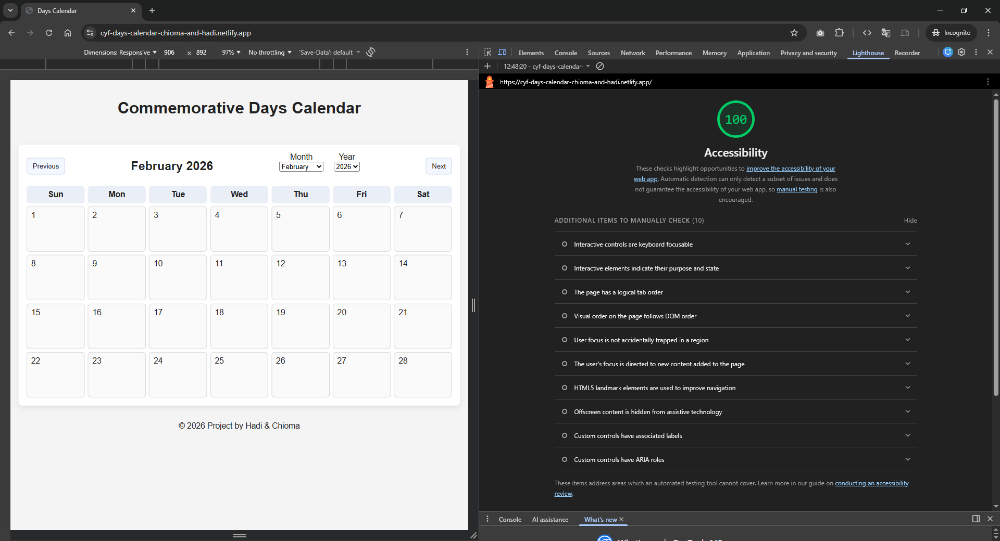
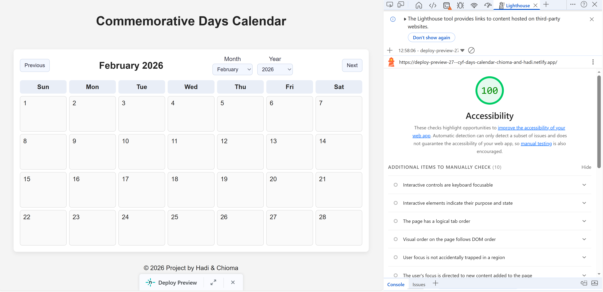

# Days Calendar Project

A dynamic, accessible web application that calculates and displays "floating" commemorative days (e.g., Ada Lovelace Day) based on annual patterns.

This project was built as part of the **CodeYourFuture Piscine** by a team of two.

## 🚀 Live Demo

**View the live site here:** [https://cyf-days-calendar-chioma-and-hadi.netlify.app](https://cyf-days-calendar-chioma-and-hadi.netlify.app)

## Netlify Deployment Status

[](https://app.netlify.com/projects/cyf-days-calendar-chioma-and-hadi/deploys)

## 🛠 Tech Stack

- Vanilla JavaScript (ES Modules)
- HTML5
- CSS
- Jest
- Netlify (Automated Deployment)

## 🛠️ Key Features

- **Dynamic Date Engine:** Calculates complex patterns (e.g., "second Tuesday" or "last Friday") without hard-coding specific dates.
- **Infinite Navigation:** Users can browse months and years indefinitely using "Next" and "Previous" buttons.
- **Jump-to-Date:** Users can skip to any month and year (1900–2100) in exactly two clicks.
- **State Synchronization:** The dropdowns and navigation buttons are perfectly synced to maintain a "single source of truth."
- **iCal Generation:** A Node.js CLI tool generates a `days.ics` file for every event from 2020–2030, ready for import into Google Calendar.
- **100% Accessible:** Scored 100 on Lighthouse Accessibility audit.

## 💻 Local Setup

1. Clone this repository.
2. Ensure you have Node.js installed.
3. Open your terminal in the project root directory and run:
   ```bash
   npm install
   npx http-server
   ```
4. Open `http://localhost:8080` in your browser.

### Generating the iCal File

To generate the `days.ics` file for terminal verification:

```bash
npm run generate:ical
```

---

## 📂 Project Structure

- `index.html`: Main UI shell.
- `src/date-utils.js`: The shared logic engine (used by Web and Node).
- `src/displayCalendar.js`: Grid rendering logic.
- `src/monthYearSelect.js`: Populates the dropdown menus and handles "Jump" event listeners.
- `src/navigation.js`: Manages Next/Previous month buttons and ensures the dropdowns and buttons stay in sync.
- `src/commemorativeDays.js`: Data fetching and event injection.
- `generate-ical.js`: Node.js script for iCal output.
- `tests/`: Jest test suite.

## Accessibility

This project achieves a score of 100 for Accessibility in Google Lighthouse.




## 🧪 Testing

- For unit test documentation, please see [TESTING.md](./TESTING.md).
- To run tests locally, use the command: `npm test`

## 👥 Team

- Chioma Okeke (@JanefrancessC)
- Hadi Vahidi (@HadiVahidi20)
